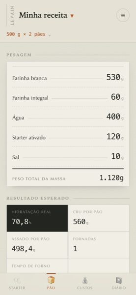
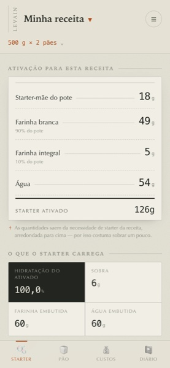
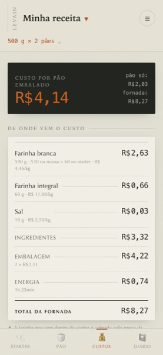

# Levain

**→ [andreaselias.github.io/levain](https://andreaselias.github.io/levain/)**

Calculadora de pão de fermentação natural, derivada de uma planilha de cálculo.
Roda no celular, offline, sem instalar nada de loja.

O objetivo — peso assado e número de pães — fica numa faixa fixa no topo, porque
muda a cada produção e dimensiona todo o resto. Abaixo dele, quatro abas sobre um
motor de cálculo só:

- **🫧 Starter** — composição própria do pote, hidratação do mãe, proporção de ativação
- **🍞 Pão** — composição e a lista de pesagem em gramas
- **💰 Custos** — preços, energia, embalagem, custo por pão
- **📓 Diário** — uma entrada por fornada, com o que mudou desde a anterior

<table>
  <tr>
    <td width="25%"></td>
    <td width="25%"></td>
    <td width="25%"></td>
    <td width="25%"></td>
  </tr>
  <tr>
    <td align="center"><sub><b>Pão</b><br>a lista de pesagem</sub></td>
    <td align="center"><sub><b>Starter</b><br>o que pesar para alimentar</sub></td>
    <td align="center"><sub><b>Custos</b><br>de onde vem cada centavo</sub></td>
    <td align="center"><sub><b>Diário</b><br>o que mudou e o que saiu</sub></td>
  </tr>
</table>

## Ingredientes

Farinhas ficam num **catálogo** com nome e preço. Quanto entra na massa e quanto
entra no pote são **duas listas independentes**, cada uma com a sua base — que
recebe o que sobrar para fechar 100%. Dá para ter centeio no pão sem ter centeio
no starter, que é o caso comum. Uma farinha que está no catálogo mas fora das
duas composições não pesa, não custa e não aparece; só guarda o preço.

Extras se dividem em dois, porque se comportam de forma diferente:

- **Líquidos** (azeite, mel, melado, leite) entram na massa e têm uma **fração de
  água** — azeite 0%, melado 25%, mel 18%, leite 87%. A água que vem junto é
  descontada da água pura, e a hidratação real reflete a verdade.
- **Sólidos** (nozes, sementes) são informados **por pão** e somam no peso sem
  alterar o equilíbrio farinha-água. O objetivo dimensiona a massa, então 40 g de
  nozes deixam o pão 40 g mais pesado que o alvo — o resumo mostra a decomposição.

Ingrediente zerado não aparece na lista de pesagem. E como ingrediente é
opcional, a aba Custos mostra o preço **item a item** e denuncia pelo nome quem
está na receita sem preço — senão o extra sairia de graça e o total mentiria em
silêncio.

`Pães por fornada` diz quantos cabem no forno de uma vez, e com isso define o
número de fornadas, o tempo total e o gasto de energia.

## Instalar no celular

Abra **[andreaselias.github.io/levain](https://andreaselias.github.io/levain/)**
no navegador do celular e use **Adicionar à Tela de Início** (Safari: botão de
compartilhar; Chrome: menu ⋮). Vira um ícone que abre em tela cheia e, depois da
primeira visita, funciona sem internet.

Também dá para usar sem servidor nenhum: baixe o `index.html` e abra direto no
aparelho. O arquivo é autocontido.

## Como funciona

O app **não** é três calculadoras separadas — as abas dependem umas das outras. A
hidratação do starter ativado entra na fórmula da farinha e da água; os pesos
entram no custo. Por isso há uma única função pura `calcular(entradas)` que
resolve tudo na ordem certa a cada tecla digitada, e as abas são só recortes do
resultado.

Os dados ficam no `localStorage` do aparelho. Nada sai dali — não há servidor,
conta nem sincronização. **Exporte de vez em quando** (☰ → Backup): limpar os
dados do navegador apaga o diário.

### As notas de 1 a 5

Vêm em dois grupos, porque são observadas em momentos diferentes e têm naturezas
diferentes:

- **Manuseio e shaping** — *pegajosidade* (seca → grudenta) e *manteve a forma*
  (espalhou → firme). São feitas com a mão na massa e são **descritivas**:
  pegajosidade 5 não é boa nem ruim, é só grudenta. Por isso os extremos vêm
  escritos, para o número não sugerir julgamento onde não há. É o sinal que
  aparece primeiro quando se mexe na hidratação.
- **Depois de assado** — *crescimento*, *abertura do miolo*, *casca* e *acidez*.
  Aqui 5 é melhor que 1.

No cartão do diário, as escalas descritivas mostram a palavra do extremo ao lado
dos pontinhos quando a nota está numa das pontas — sem isso, `●●●●●` não diz
qual ponta é qual para quem reler daqui a meses.

### O que cada campo de processo significa

No registro de fornada, os três campos de tempo e temperatura são o que a
planilha nunca cobriu mas muda o resultado tanto quanto a hidratação:

| Campo | O que é |
|---|---|
| **Fermentação (h)** | O tempo em massa — da mistura até dividir e modelar, com a massa ainda inteira numa tigela só |
| **Geladeira (h)** | O retardo a frio, com os pães já modelados, antes de ir ao forno |
| **Ambiente (°C)** | A temperatura da cozinha, que é o que faz a mesma receita levar 4 h no verão e 8 h no inverno |

### Calibrar a perda no forno

A planilha chuta 11% de perda de peso no forno. No diário, informe o peso real de
um pão assado e o app resolve a perda verdadeira e grava na receita. É o que troca
o chute por medição. Extras sólidos são descontados dos dois lados da conta: eles
não perdem água, e incluí-los faria a perda parecer menor do que é.

## Desenvolvimento

```sh
npm test     # 103 testes do motor, da migração e do armazenamento
npm run build
```

O build é **determinístico** — nenhuma data ou valor aleatório entra nele —, e é
por isso que o workflow de publicação consegue conferir se o `index.html`
commitado bate com o `src/`. Se alguém mexer no código e esquecer de rodar o
build, a publicação falha em vez de subir um site defasado.

O build gera dois arquivos autocontidos, com CSS, JS e ícones embutidos:

| Arquivo | Para quê |
|---|---|
| `index.html` | documento completo — abrir no celular, instalar na tela de início |
| `artifact.html` | mesmo conteúdo sem `<head>`, para publicar como Artifact |

O JavaScript vira um script clássico de propósito: módulos ES são bloqueados por
CORS quando a página abre via `file://`, que é justamente o caso de uso.

`sandbox.html` embute o app num iframe com `sandbox`, reproduzindo as condições
do link publicado. Vale conferir ali qualquer coisa que dependa de API do
navegador: nesse contexto `confirm()`, `alert()` e download são **ignorados em
silêncio**. É por isso que o app tem diálogo e recado próprios em vez dos
nativos, e por isso o backup oferece copiar e colar além de baixar arquivo.

### Estrutura

```
src/calc.js       motor puro — sem DOM, sem estado, testável no Node
src/campos.js     rótulo, aba, unidade e formatação de cada entrada
src/migrar.js     conversão do formato antigo de campos fixos para o catálogo
src/store.js      receitas, diário, diff, export/import, persistência
src/app.js        interface
src/styles.css    estilo
build.mjs         empacota tudo; também desenha o ícone PNG
```

`src/calc.js` reproduz a planilha ao pé da letra, inclusive o arredondamento do
Excel — que normaliza para 15 dígitos significativos antes de arredondar. Sem
isso a água sai 390 g em vez de 400 g, porque `(590+60)×0,7` vale
`454,99999999999994` em ponto flutuante.

Comportamentos da planilha preservados de propósito, porque são os números que já
se conhece de cor:

1. A **água não tem custo**
2. Cada ingrediente arredonda por conta própria, não o total

Dois outros foram deliberadamente **corrigidos** nesta versão: extras sólidos
agora entram no peso, e a farinha de dentro do starter passou a ser cobrada pelo
preço da farinha dele em vez do da branca. Receitas salvas no formato antigo são
convertidas ao abrir, e há teste provando que os números não mudam — a exceção
combinada são os extras.

O projeto e a referência completa de fórmulas estão em
[`docs/superpowers/specs/`](docs/superpowers/specs/).

## Licença

[MIT](LICENSE) — use, altere e redistribua à vontade, inclusive comercialmente.
Só mantenha o aviso de copyright.
